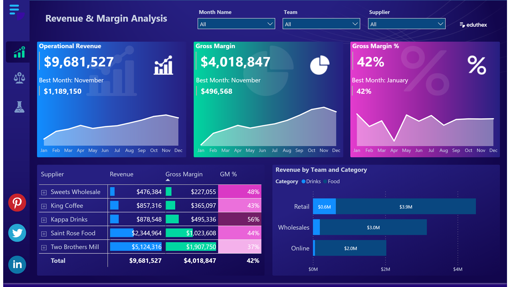
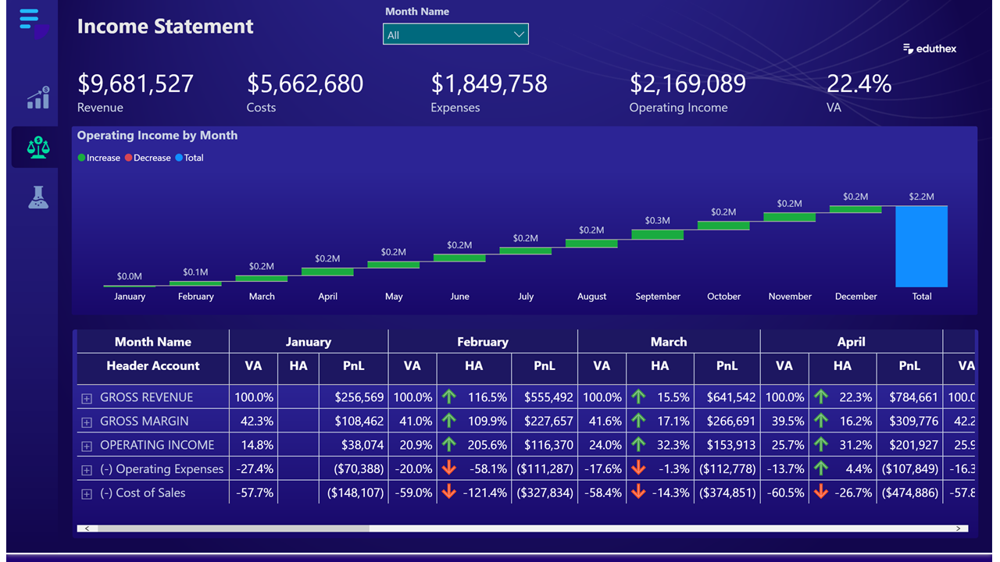
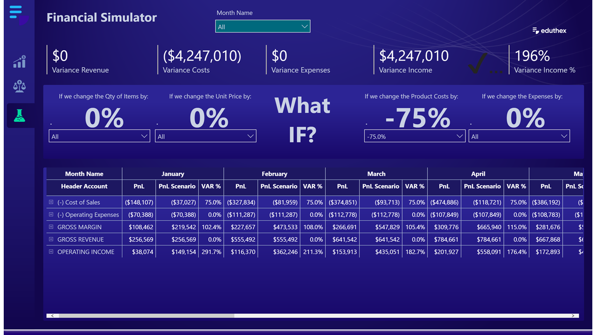

# Financial Dashboard Modeling

**This project was inspired by Leonardo karpinski**

## Project Overview

Welcome to the Financial Dashboard Modeling project, where I leveraged the capabilities of Power BI to create a comprehensive financial report. The project involved extensive use of DAX (Data Analysis Expressions) language for creating measures and M language for data transformation within the Power Query Editor.

## Features

* **Key Indicators:**

- Operational Revenue
- Gross Margin
- Gross Margin Percentage
  
* **Data Transformation:**
  
- Utilized M code in the Power Query Editor for data extraction and transformation.
- Created custom columns and performed various transformations to enhance data quality.
  

* **DAX Language Usage:**

- Developed measures, calculated columns, and tables using the DAX language in Power BI Desktop.

## Report Pages

### 1. Revenue & Margin

* **Matrix Table:**

- Analyzes calculated measures by Suppliers and Groups.
  
* **Stacked Bar Chart:**
  
- Displays revenue breakdown by category (e.g., Retail).
  
* **Insights:**

- Highlights the month with the highest operational revenue and gross margin.
- Points out the month with the highest gross margin percentage.

  

### 2. Income Statement

* **Trend Analysis:**
  
- Illustrates the increase and decrease in operating income for each month.
  
* **Account Analysis:**
  
- Breaks down header account, subheader account, and detailed account using horizontal and vertical analysis.
  
* **Profit and Loss Indicators:**
  
- Provides insights into profit and loss for each month.

  

### 3. Financial Simulator

* **What IF? Scenarios:**
  
- Allows users to simulate scenarios within the Power BI report.
- Predicts variance in revenue, costs, expenses, and more.

Here is a link to the interactive report: [Power BI Report](https://app.powerbi.com/view?r=eyJrIjoiMTJiYTBiYTUtOTZiZS00Y2FkLTgwOGEtYjY3ZDJjMjk1NTU4IiwidCI6IjkxODk1NjgwLTdkMDMtNDg4My1iMmJhLTUxMDk2MzM2YzI4MyJ9&pageName=ReportSection)

## Usage

**1. Clone the Repository:**

`git clone https://github.com/your-username/Financial_Dashboard_Modeling.git`

**2. Open the Power BI Report:**

* Locate the Power BI report file (Financial_Dashboard_Modeling.pbix) in the repository.
* Open the file using Microsoft Power BI Desktop.
  

**3. Explore the Insights:**

* Navigate through the visualizations and tabs to explore detailed financial insights.
  

**4. Financial Simulation:**

* Interact with the report in the Financial Simulator page to predict various scenarios using the What IF? section.
  

## License

This project is licensed under the MIT License - see the [LICENSE](/LICENSE.md) file for details.

## Contribution

Contributions are welcome! Feel free to open issues or submit pull requests to enhance the project.

